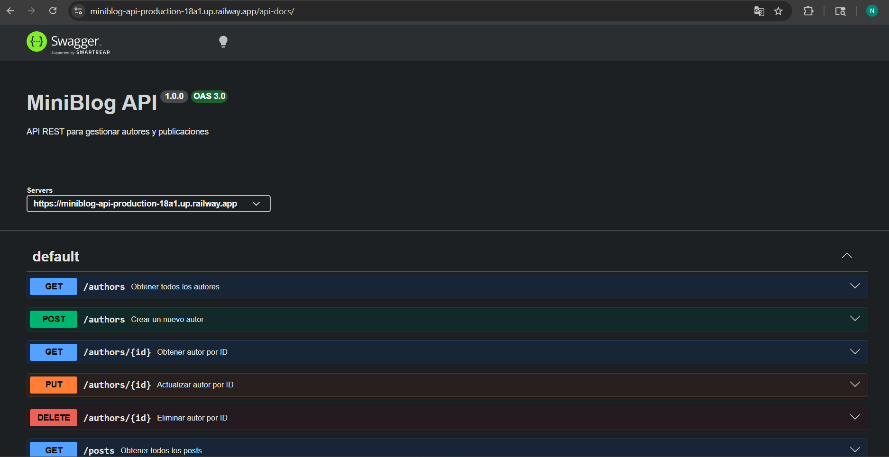

# 📝 MiniBlog API


> API REST desarrollada con **Node.js**, **Express** y **PostgreSQL** para gestionar autores y publicaciones.

---

## ✨ Features

- ✅ CRUD completo de **authors**
- ✅ CRUD completo de **posts**
- ✅ Base de datos **PostgreSQL**
- ✅ Queries SQL parametrizadas (sin ORM)
- ✅ Validaciones de entrada
- ✅ Testing con **Jest** y **Supertest**
- ✅ Documentación **Swagger / OpenAPI**

---

## 🛠️ Tecnologías

| Tecnología       | Uso                          |
|------------------|------------------------------|
| Node.js          | Runtime                      |
| Express          | Framework HTTP               |
| PostgreSQL       | Base de datos relacional     |
| pg               | Cliente PostgreSQL para Node |
| Jest             | Framework de testing         |
| Supertest        | Testing de endpoints HTTP    |
| Swagger UI Express | Documentación interactiva  |

---

## 🚀 Instalación

### 1. Clonar el repositorio

```bash
git clone https://github.com/Nataliamicaela/miniblog-api.git
cd miniblog-api
```

### 2. Instalar dependencias

```bash
npm install
```

---

## ⚙️ Variables de entorno

Crear un archivo `.env` en la raíz del proyecto con las siguientes variables:

```env
DB_HOST=localhost
DB_PORT=5432
DB_NAME=miniblog
DB_USER=postgres
DB_PASSWORD=tu_password
PORT=3000
```

> ⚠️ No subas el archivo `.env` al repositorio. Asegurate de que esté incluido en `.gitignore`.

> 💡 El archivo `.env.example` incluido en el repositorio contiene todas las variables necesarias como referencia.

---

## 🗄️ Configuración de la base de datos

### Crear el schema

```bash
psql -U postgres -d miniblog -f db/schema.sql
```

### Cargar datos de prueba (seed)

```bash
psql -U postgres -d miniblog -f db/seed.sql
```

> Asegurate de que la base de datos `miniblog` exista antes de correr los comandos. Podés crearla con `createdb miniblog` o desde `psql` con `CREATE DATABASE miniblog;`.

---

## ▶️ Ejecutar el proyecto

### Modo desarrollo

```bash
npm run dev
```

> Usa **node --watch** para reiniciar automáticamente ante cambios en el código.

### Modo producción

```bash
npm start
```

> Ejecuta el servidor sin hot-reload. Recomendado para entornos productivos.

---

## 🧪 Ejecutar tests

```bash
npm test
```

Los tests están escritos con **Jest** y **Supertest**, que permite testear los endpoints HTTP directamente sin necesidad de levantar el servidor manualmente.

---

## 📖 Documentación Swagger

Una vez levantado el servidor, la documentación interactiva está disponible en:

### Local

```
http://localhost:3000/api-docs
```

Desde ahí podés:

- 📋 Visualizar todos los endpoints disponibles
- 🔍 Ver los parámetros y esquemas de request/response
- ▶️ Probar requests directamente desde el navegador

### Producción

```
https://miniblog-api-production-18a1.up.railway.app/api-docs 
```




---

## 📌 Endpoints principales

### Authors

| Método   | Endpoint            | Descripción                    |
|----------|---------------------|--------------------------------|
| `GET`    | `/authors`          | Obtener todos los autores      |
| `GET`    | `/authors/:id`      | Obtener un autor por ID        |
| `POST`   | `/authors`          | Crear un nuevo autor           |
| `PUT`    | `/authors/:id`      | Actualizar un autor            |
| `DELETE` | `/authors/:id`      | Eliminar un autor              |

### Posts

| Método   | Endpoint                      | Descripción                          |
|----------|-------------------------------|--------------------------------------|
| `GET`    | `/posts`                      | Obtener todos los posts              |
| `GET`    | `/posts/:id`                  | Obtener un post por ID               |
| `GET`    | `/posts/author/:authorId`     | Obtener posts de un autor específico |
| `POST`   | `/posts`                      | Crear un nuevo post                  |
| `PUT`    | `/posts/:id`                  | Actualizar un post                   |
| `DELETE` | `/posts/:id`                  | Eliminar un post                     |

---

## ☁️ Deployment

La API está desplegada en **Railway** y disponible públicamente:

| Recurso | URL |
|---|---|
| 🌐 API Base | https://miniblog-api-production-18a1.up.railway.app |
| 📖 Swagger Online | https://miniblog-api-production-18a1.up.railway.app/api-docs |

La configuración se gestiona completamente a través de variables de entorno.
No se requieren cambios en el código para producción.

---

## 🤖 Uso de IA en el proyecto

Durante el desarrollo de este proyecto se utilizó IA como herramienta de apoyo en las siguientes etapas:

### Diseño del schema SQL
Se iteró el diseño de la base de datos con prompts progresivamente más detallados,
incorporando buenas prácticas como TIMESTAMPTZ, índices y constraints.

### Generación y revisión de código
Se utilizó IA para asistir en la generación de boilerplate,
validaciones, rutas, middlewares y debugging del proyecto,
revisando y adaptando cada resultado al contexto real de la aplicación.

### Testing
Se generaron casos de prueba base con Jest y Supertest, luego ajustados
manualmente para cubrir los escenarios específicos de la API.

### Documentación
La estructura del README y los comentarios de Swagger fueron asistidos por IA
y revisados para garantizar precisión técnica.

> ⚠️ Todo el código generado fue revisado, comprendido y adaptado manualmente.
> La IA se utilizó como herramienta de productividad, no como reemplazo del criterio propio.

---

## 👩‍💻 Autor

Developed by **Natalia Alvarez**